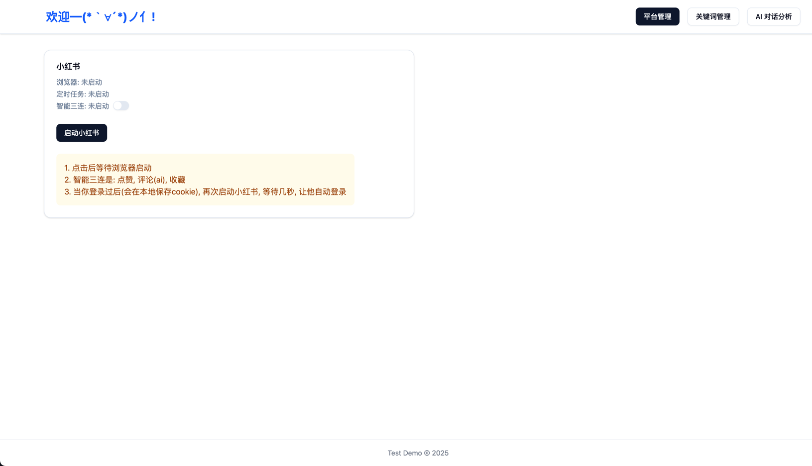
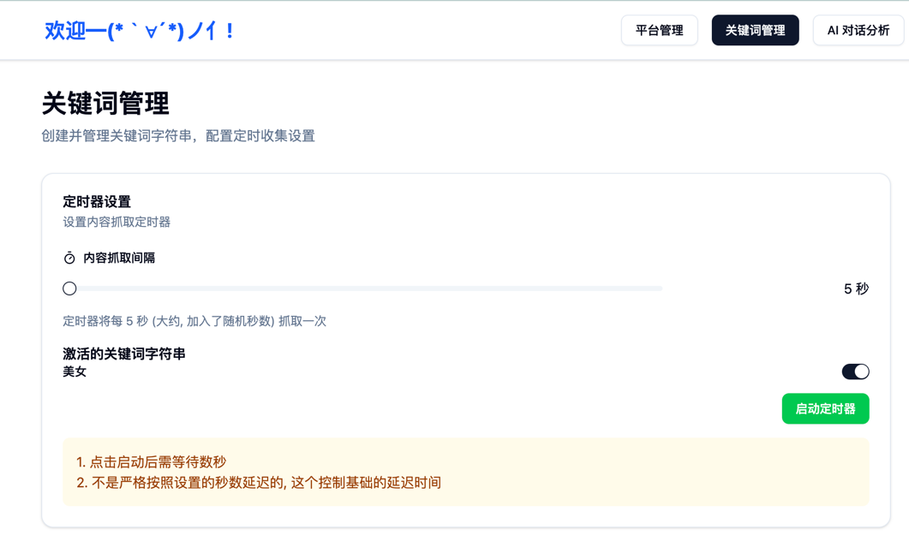
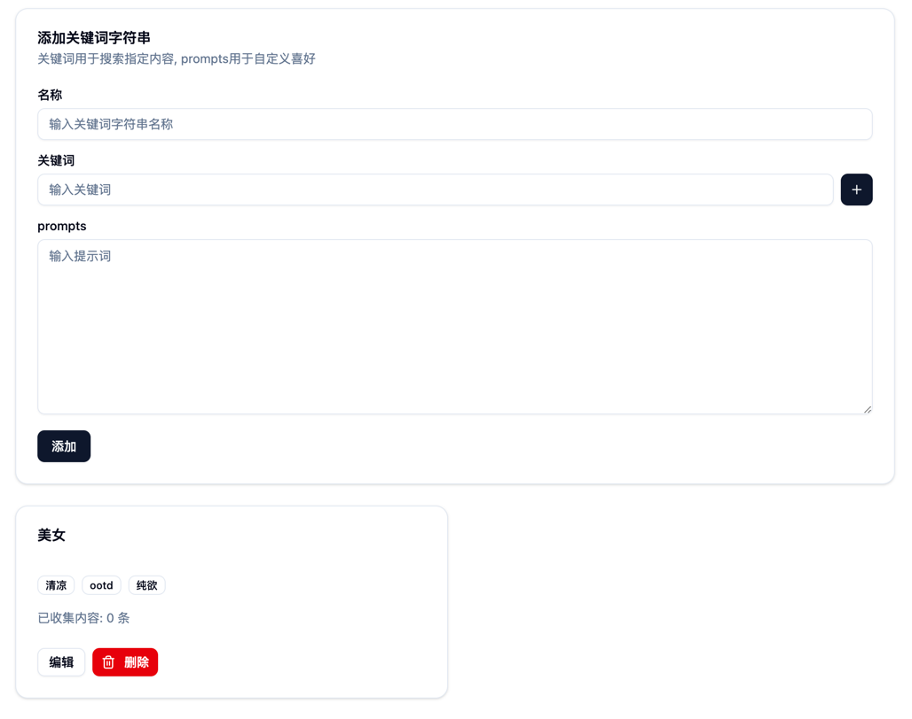
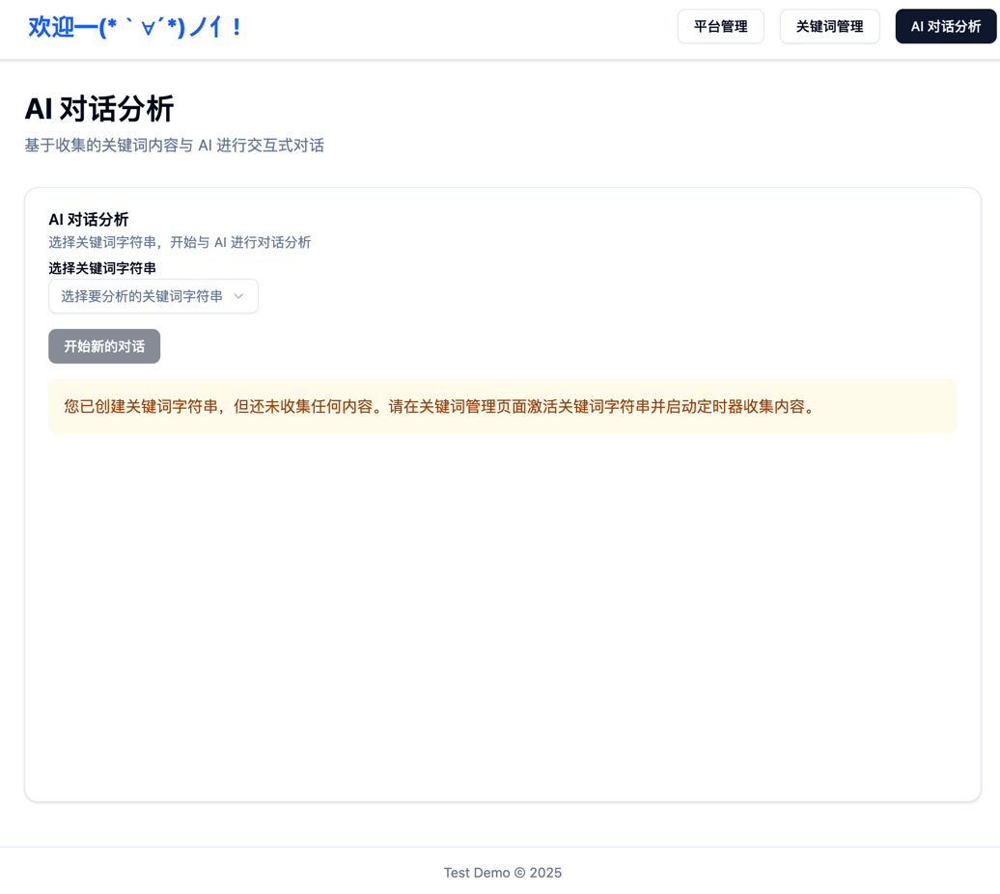

# 项目说明

## 一, 项目概述

本项目帮助用户通过关键词对特定平台（小红书）进行内容抓取和分析。系统提供了平台管理、关键词管理和AI对话分析三个主要功能模块, 在获取到一个文章的后会根据关键词管理模块配置的prompts调用gemini获取结构化数据(json), 判断是否进行三连, ai对话选取关键词后会在上下文中带上此关键词的文章信息。

## 二, 功能模块

### 1. 平台管理



平台管理模块主要用于管理与特定平台（仅支持小红书）相关的设置和操作。用户可以通过此模块启动或停止平台相关的功能，如selenium浏览器、智能三连。

- **小红书平台**
  - **浏览器状态**：显示浏览器是否已启动。
  - **定时任务状态**：显示定时任务是否已启动。
  - **智能三连状态**：显示智能三连（点赞、评论、收藏）功能是否已启动, 可手动启动/关闭。
  - **启动按钮**：用户可以点击此按钮启动selenium登录浏览器, 观察定时器运行状态。

### 2. 关键词管理




关键词管理模块允许用户创建和管理关键词字符串，并配置定时抓取相关设置。

- **定时器设置**

  - **内容抓取间隔**：设置抓取内容的时间间隔。
  - **激活的关键词字符串**：显示当前激活的关键词字符串, 同一时刻只能激活一个关键词。
  - **启动定时器按钮**：用户可以点击此按钮启动定时抓取功能。
- **添加关键词字符串**

  - **名称**：输入关键词字符串的名称。
  - **关键词**：输入需要抓取的关键词。
  - **prompts**：输入用于自定义喜好的提示词, 可根据已有的提示词自行修改。

### 3. AI对话分析



AI对话分析模块基于收集的关键词内容，与AI进行交互式对话。用户可以查看AI的分析结果，并与AI进行进一步的对话。

- **AI对话分析**
  - **选择关键词字符串**：用户可以选择一个关键词字符串开始与AI对话。

# 项目启动说明

## 一, 获取 gemini api key

官方地址: https://aistudio.google.com/app/apikey

得到key之后写入backend目录下的.env文件中

## 二, 启动后端项目(8000端口)

1. 后端使用uv管理依赖

   - 安装uv: https://docs.astral.sh/uv/getting-started/installation/
2. 在 backend 目录下执行 `uv sync`, 下载依赖
3. 在 backend 目录下, 执行测试

   ```shell
   uv run pytest -s
   ```

   如果测试成功会输出

   ```text
   🎉 Chrome驱动安装路径: 你的backend路径/.wdm/drivers/chromedriver/..../chromedriver
   🎉 Gemini API 测试成功！
   ```

   如果chrome驱动测试失败, 可以ctrl c结束并重新测试, 多重试几次, 或者像下面这样设置代理

   ```shell
   export https_proxy=http://127.0.0.1:你的代理工具的本地代理端口 http_proxy=http://127.0.0.1:你的代理工具的本地代理端口
   ```

   如果 gemini 测试失败, 把代理节点换到[Gemini API 的适用区域,](https://ai.google.dev/gemini-api/docs/available-regions?hl=zh-cn) 如印度

   然后单独执行gemini测试, 直到测试通过

   ```shell
   uv run pytest -vs ./app/core/test_RedBook.py::test_gemini_api
   ```
4. 在 backend 目录下, 初始化 sqllite 数据库

   ```shell
   uv run python -m app.init_data
   ```
5. 在 backend 目录下, 启动

   ```shell
   uv run fastapi dev
   ```
6. 接口文档地址

  http://127.0.0.1:8000/docs

## 三, 启动前端项目

1. 在 frontend 下执行 `npm install`, 下载依赖
2. 在 frontend 下执行 `npm run dev`, 启动前端

# 操作流程

## 一, 启动平台

1. 在平台管理模块中，点击“启动小红书”按钮。
2. 等待selenium浏览器启动。
3. 开启三连功能可选，以便自动进行点赞、评论和收藏操作。
4. 在关键词管理模块中, 点击“启动定时器”按钮，开始定时抓取内容。

## 二, 进行AI对话

1. 在AI对话分析模块中，选择一个关键词字符串。
2. 在输入框中输入问题，然后点击发送按钮。多行输入使用shift+enter换行, 点击enter发送

# 注意事项

1. **浏览器启动**：点击启动按钮后，需要等待浏览器启动。
2. **智能三连**：智能三连功能包括点赞、评论（AI）和收藏。
3. **登录状态**：登录后，系统会在本地保存cookie，再次点击“启动小红书”启动时会自动登录(要等待几秒)。
4. **定时抓取**：定时抓取功能会按照设置的时间间隔抓取内容，但实际延迟时间可能略有不同。


